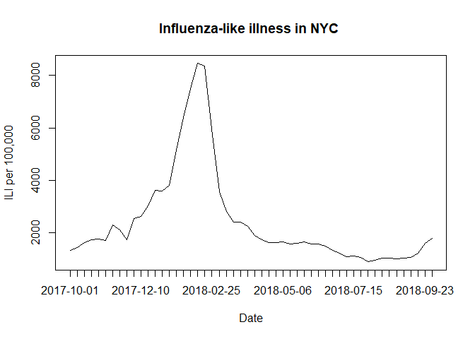
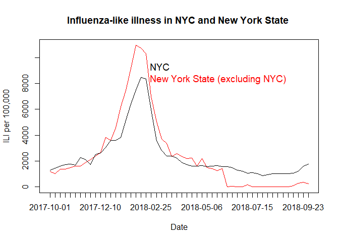
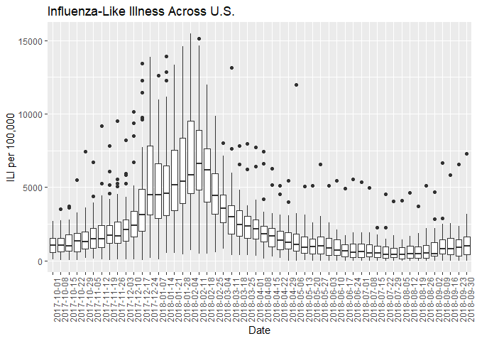

hw1
================
Matthew Perrotta
January 29, 2019

``` r
library(tidyverse)
```

    ## -- Attaching packages ---------------------------------------------------------------------------------- tidyverse 1.2.1 --

    ## v ggplot2 3.0.0     v purrr   0.2.5
    ## v tibble  1.4.2     v dplyr   0.7.6
    ## v tidyr   0.8.1     v stringr 1.3.1
    ## v readr   1.1.1     v forcats 0.3.0

    ## -- Conflicts ------------------------------------------------------------------------------------- tidyverse_conflicts() --
    ## x dplyr::filter() masks stats::filter()
    ## x dplyr::lag()    masks stats::lag()

Import data

``` r
ili = read.csv('./da_ILINet.csv')
```

Problem 1

``` r
names(ili)
```

    ##  [1] "Date"                 "Alabama"              "Alaska"              
    ##  [4] "Arizona"              "Arkansas"             "California"          
    ##  [7] "Colorado"             "Connecticut"          "Delaware"            
    ## [10] "District.of.Columbia" "Florida"              "Georgia"             
    ## [13] "Hawaii"               "Idaho"                "Illinois"            
    ## [16] "Indiana"              "Iowa"                 "Kansas"              
    ## [19] "Kentucky"             "Louisiana"            "Maine"               
    ## [22] "Maryland"             "Massachusetts"        "Michigan"            
    ## [25] "Minnesota"            "Mississippi"          "Missouri"            
    ## [28] "Montana"              "Nebraska"             "Nevada"              
    ## [31] "New.Hampshire"        "New.Jersey"           "New.Mexico"          
    ## [34] "New.York"             "New.York.City"        "North.Carolina"      
    ## [37] "North.Dakota"         "Ohio"                 "Oklahoma"            
    ## [40] "Oregon"               "Pennsylvania"         "Puerto.Rico"         
    ## [43] "Rhode.Island"         "South.Carolina"       "South.Dakota"        
    ## [46] "Tennessee"            "Texas"                "Utah"                
    ## [49] "Vermont"              "Virgin.Islands"       "Virginia"            
    ## [52] "Washington"           "West.Virginia"        "Wisconsin"           
    ## [55] "Wyoming"

``` r
ili[2, 'Massachusetts']
```

    ## [1] 892

``` r
ili[2, 6]
```

    ## [1] 1535

``` r
ili %>% 
  slice(2) %>% 
  select(6)
```

    ##   California
    ## 1       1535

``` r
ili[30, 5:14]
```

    ##    Arkansas California Colorado Connecticut Delaware District.of.Columbia
    ## 30     1596       1910      720        2659      109                 1604
    ##    Florida Georgia Hawaii Idaho
    ## 30      NA    1951   3094   333

``` r
ili %>% 
  slice(30) %>% 
  select(5:14)
```

    ##   Arkansas California Colorado Connecticut Delaware District.of.Columbia
    ## 1     1596       1910      720        2659      109                 1604
    ##   Florida Georgia Hawaii Idaho
    ## 1      NA    1951   3094   333

``` r
ili[, 5]
```

    ##  [1]   812  1099   789  1351  1180  1199  2125  1706  2556  3693  5115
    ## [12]  9776 10950  7692 10183  9549  8625 11053  9788  7629  6268  4226
    ## [23]  2979  2349  1662  1332   834  1010  1158  1596  1158  1736  1263
    ## [34]  1127  1196  1178  1371   564   654   633   689   763   449   542
    ## [45]   760   513   611   977   831   821   921  1665

``` r
ili %>% 
  select(5)
```

    ##    Arkansas
    ## 1       812
    ## 2      1099
    ## 3       789
    ## 4      1351
    ## 5      1180
    ## 6      1199
    ## 7      2125
    ## 8      1706
    ## 9      2556
    ## 10     3693
    ## 11     5115
    ## 12     9776
    ## 13    10950
    ## 14     7692
    ## 15    10183
    ## 16     9549
    ## 17     8625
    ## 18    11053
    ## 19     9788
    ## 20     7629
    ## 21     6268
    ## 22     4226
    ## 23     2979
    ## 24     2349
    ## 25     1662
    ## 26     1332
    ## 27      834
    ## 28     1010
    ## 29     1158
    ## 30     1596
    ## 31     1158
    ## 32     1736
    ## 33     1263
    ## 34     1127
    ## 35     1196
    ## 36     1178
    ## 37     1371
    ## 38      564
    ## 39      654
    ## 40      633
    ## 41      689
    ## 42      763
    ## 43      449
    ## 44      542
    ## 45      760
    ## 46      513
    ## 47      611
    ## 48      977
    ## 49      831
    ## 50      821
    ## 51      921
    ## 52     1665

``` r
ili[36, 'New.York.City']
```

    ## [1] 1566

``` r
ili %>% 
  slice(36) %>% 
  select('New.York.City')
```

    ##   New.York.City
    ## 1          1566

``` r
ili[order(ili$'New.York.City', decreasing = T),] %>% 
  select('New.York.City', Date)
```

    ##    New.York.City       Date
    ## 19          8458 2018-02-11
    ## 20          8363 2018-02-18
    ## 18          7507 2018-02-04
    ## 17          6395 2018-01-28
    ## 21          5957 2018-02-25
    ## 16          5148 2018-01-21
    ## 15          3811 2018-01-14
    ## 13          3603 2017-12-24
    ## 14          3601 2018-01-07
    ## 22          3552 2018-03-04
    ## 12          3034 2017-12-17
    ## 23          2800 2018-03-11
    ## 11          2612 2017-12-10
    ## 10          2525 2017-12-03
    ## 25          2408 2018-03-25
    ## 24          2398 2018-03-18
    ## 7           2280 2017-11-12
    ## 26          2251 2018-04-01
    ## 8           2115 2017-11-19
    ## 27          1900 2018-04-08
    ## 52          1773 2018-09-30
    ## 5           1758 2017-10-29
    ## 9           1736 2017-11-26
    ## 4           1732 2017-10-22
    ## 28          1725 2018-04-15
    ## 6           1705 2017-11-05
    ## 34          1653 2018-05-27
    ## 31          1644 2018-05-06
    ## 3           1628 2017-10-15
    ## 29          1628 2018-04-22
    ## 30          1623 2018-04-29
    ## 51          1601 2018-09-23
    ## 33          1594 2018-05-20
    ## 35          1574 2018-06-03
    ## 36          1566 2018-06-10
    ## 32          1564 2018-05-13
    ## 37          1485 2018-06-17
    ## 2           1435 2017-10-08
    ## 1           1313 2017-10-01
    ## 38          1312 2018-06-24
    ## 39          1225 2018-07-01
    ## 50          1214 2018-09-16
    ## 41          1116 2018-07-15
    ## 40          1067 2018-07-08
    ## 49          1049 2018-09-09
    ## 42          1042 2018-07-22
    ## 48          1033 2018-09-02
    ## 46          1022 2018-08-19
    ## 45          1013 2018-08-12
    ## 47          1011 2018-08-26
    ## 44           957 2018-08-05
    ## 43           881 2018-07-29

Problem 2

``` r
plot(ili$New.York.City, type='l', lty=1, main='Influenza-like illness in NYC ', xaxt='n', xlab='Date', ylab='ILI per 100,000')
axis(1, at=1:nrow(ili), labels = ili$Date) 
```



Problem 3

``` r
plot(ili$New.York, col = 'red', type='l', lty=1, main='Influenza-like illness in NYC and New York State ', xaxt='n', xlab='Date', ylab='ILI per 100,000')
lines(ili$New.York.City)
axis(1, at=1:nrow(ili), labels = ili$Date)
legend('topright',
  legend = c("NYC", "New York State (excluding NYC)"), 
  col = c('black', 'red'),
  pch = c(NA,NA), 
  bty = "n", 
  pt.cex = 2, 
  cex = 1.2, 
  text.col = c("black", 'red'), 
  horiz = F , 
  inset = c(0.1, 0.1))
```



Problem 4

``` r
ili %>% 
  gather(key = location, value = ili_cases, Alabama:Wyoming) %>% 
  ggplot(aes(x = Date, y = ili_cases)) +
  geom_boxplot() +
  theme(legend.position = 'none', axis.text.x = element_text(angle = 90, hjust = 1)) +
  labs(
    title = 'Influenza-Like Illness Across U.S.',
    y = 'ILI per 100,000'
  )
```

    ## Warning: Removed 52 rows containing non-finite values (stat_boxplot).



Problem 5 + 6

``` r
quad_eq = function(a, b, c){
  x1 = (-b + sqrt(b^2 - 4*a*c)) / (2*a)
  x2 = (-b - sqrt(b^2 - 4*a*c)) / (2*a)
  quad_eq = c(x1, x2)
}

a = quad_eq(2, 10, 3)
a
```

    ## [1] -0.3205505 -4.6794495

``` r
b = quad_eq(5, -6, 1)
b
```

    ## [1] 1.0 0.2
